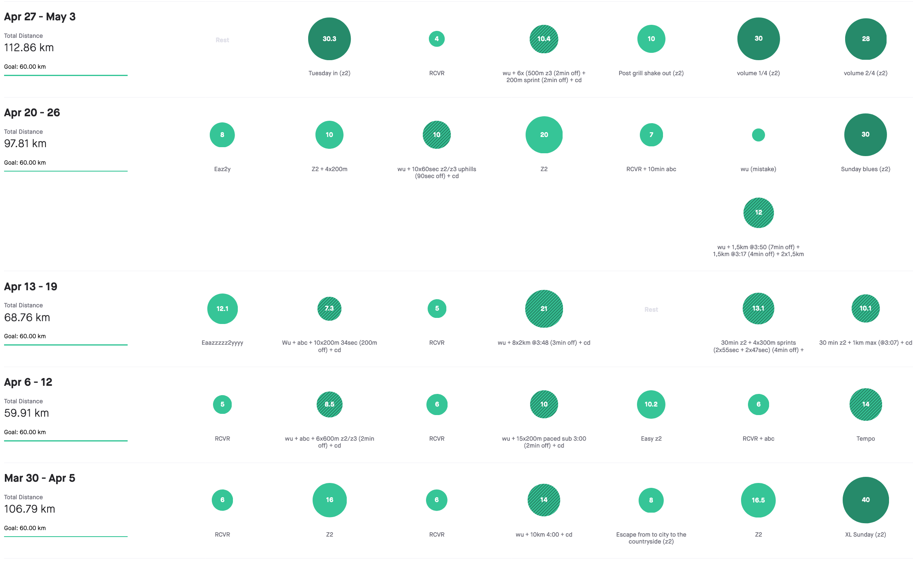

Twenty-seven days. Well, that’s an impressive strike for having a delay with a blog post. In particular realizing, that most of the world is now locked down. 

Honestly, I’m not sure what has happened. I wasn’t that much busy to not have time for this blog. I’m good with finding time for things I like to do so there is no space for such kind of excuses. Also, I wasn’t paralyzed by the COVID-19 situation.

As the days were going by, I was just following my weekly plans and running. Running. And also, some other running too.

With the races being cancelled, there isn’t a need from my side to focus on speed workouts. So with fewer workouts, there is also fewer recovery days and more volume. Naturally, it has imprinted on my monthly amount which dropped to **354km** for an April. More than 80km compared to April 2019. Also, the average distance per run has slightly increased as well as the days spent on running, **29** instead to **24**.

Yes. I do like to log every sort of numbers. My after running routine just doesn’t end up with finished upload to Strava. Additionally, I have a unique table for all kinds of stuff. But this, I will save for the next post.

Wish me luck to be there on time with the next post

| **2:45 - 2:59** | **3:00 - 3:29** | **3:30 - 3:44** | **3:45 - 3:59** | **4:00 - 4:14** | **4:15 - 4:29** | **4:30 - 4:44** | **4:44 - 4:59** | **5:00 >** | **6:00 >** | **sum** |
| --------------- | --------------- | --------------- | --------------- | --------------- | --------------- | --------------- | --------------- | ---------- | ---------- | ------- |
| 2,4             | 7,5             | 0               | 25,5            | 15              | 18,6            | 65              | 142,54          | 77,5       | 0          | 354,54  |

