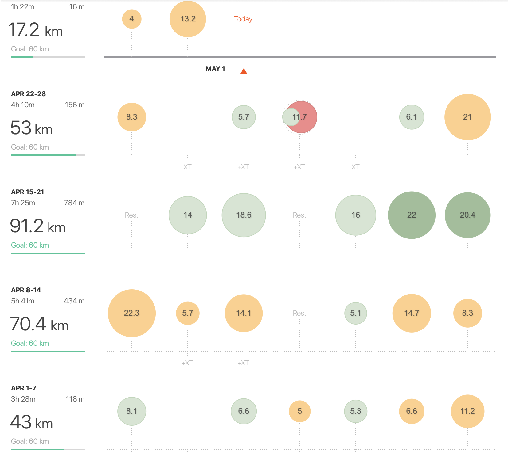

>FAST!!!

... it's how I would sum up another running month.

Eventhough the total milage of **275km** is the least since the beginning of the year, it is adequate result realizing almost **90km** was paced ***sub 4:15 min/km***. Guess one just have to take a deep breath afterwards. Fact I'm considering 4:15 min/km as a fast pace is because my goal for this year is to finish marathon under 3hours, which is about that pace. I have to say I'm starting to feel really confident running in that zone so I hope this feelings are going to grown further. One and only!

My [last post](https://www.tracetheheat.com/march/march/) was ending with a questionmark about my 5k and 10k races. So how did that go?

## 5k
**Shortly - not that good as I was expecting.** I guess it just wasnt the day. My expectations were somewhere around 3:40 min/km but I wasn't able to keep this tempo in the end of the track. My guess is that race starting at 8 pm is bit tricky for nutrition throughout the day + it's the time of the day when I'm used to be after training just relaxing. I think I just wasnt expected that fatigue is going to kick me and hold me back. Still made PB (3:50).

## 10k
**Shortly - good but...** 10km race was starting also at 8 pm so I've learned from my previous mistakes which helped me to feel more relaxed and resulted in 1st place! So at this place I could definiteliy give myself a ***KUDOS*** because running whole race in the front and last 2km under pressure while other guys were breathing on my back was something new for me. Unfortunately I did not break 40minutes (goood daamn it, 5 secoonds!) but because the whole run was totally under my control I don't feel that bad as after 5k race. The main distiction between the 5k race and 10k was that I've started slower and was holding first 2km righ under 4 min/km and after I've started to push some extra effort. The last km was the second fastes from the whole race. Wohoo.
  
So to ended up somehow I could say both races gave me something I could work with. ***Firtsly*** to focus when is the race and adjust my rythm slightly to it and ***secondly*** to have some strategy for the race.

>Let's hope I'm not bullshiting myself and upcoming half marathon which is in 5 days will meet my expectations. 

So stay tuned and if you don't want to miss anything you could **subscribe** this blog below or feel free to leave here a **comment** with yours experiences.

