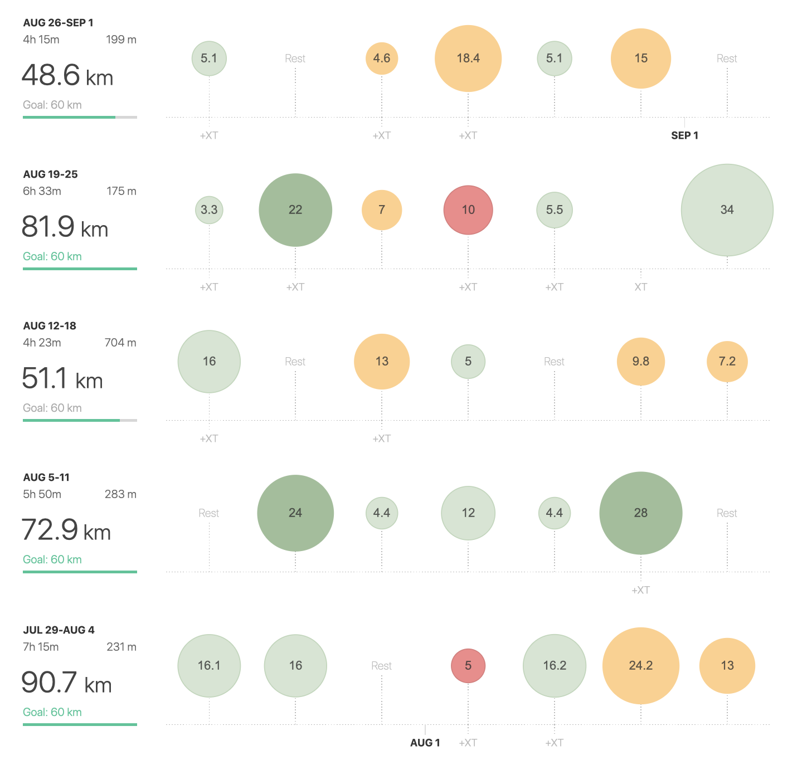

> Last month to go! 🏁 

August was great and the training had the same flow as in June ☀️ - lot’s of sessions paced bit faster then my expected pace for marathon (+-4:15) and naturally some long runs too. Finishing with 313km is nothing surprising at the moment. Besides my regular training I've also managed to make new **PB at 5km (18:45) and 10km (38:50)! KUDOS 👍** 

> It’s good to see there is a progress, let's hope it's enough for sub 3!

Even though I was doing great all month, I do have now, when writing this post, some sort of “blogging blues”. It’s not that I don't want to keep going with writing. It's just maybe more then focusing on each run I did over the last month, I'm now more looking on the horizon. The outlines of my main goal are getting clear and they are closer each day. My mind thus shifted from analyzing each finished kilometer to preparing the head.

September is going to be about concentration and resting. Resting the body and mostly the mind. I think the body is going to be relaxed enough, but the question in my head is, am I going to have enough willpower to play hard in the last part of the race? 

I'm really looking forward what the next month will bring so stay with me!

| **3:00 - 3:29** | **3:30 - 3:44** | **3:45 - 3:59** | **4:00 - 4:14** | **4:15 - 4:29** | **4:30 - 4:44** | **4:44 - 4:59** | **5:00 >** | **6:00 >** | **sum** |
| --------------- | --------------- | --------------- | --------------- | --------------- | --------------- | --------------- | ---------- | ---------- | ------- |
|                 | 2               | 14              | 65              | 41              | 38              | 50              | 100        | 3          | 313     |

