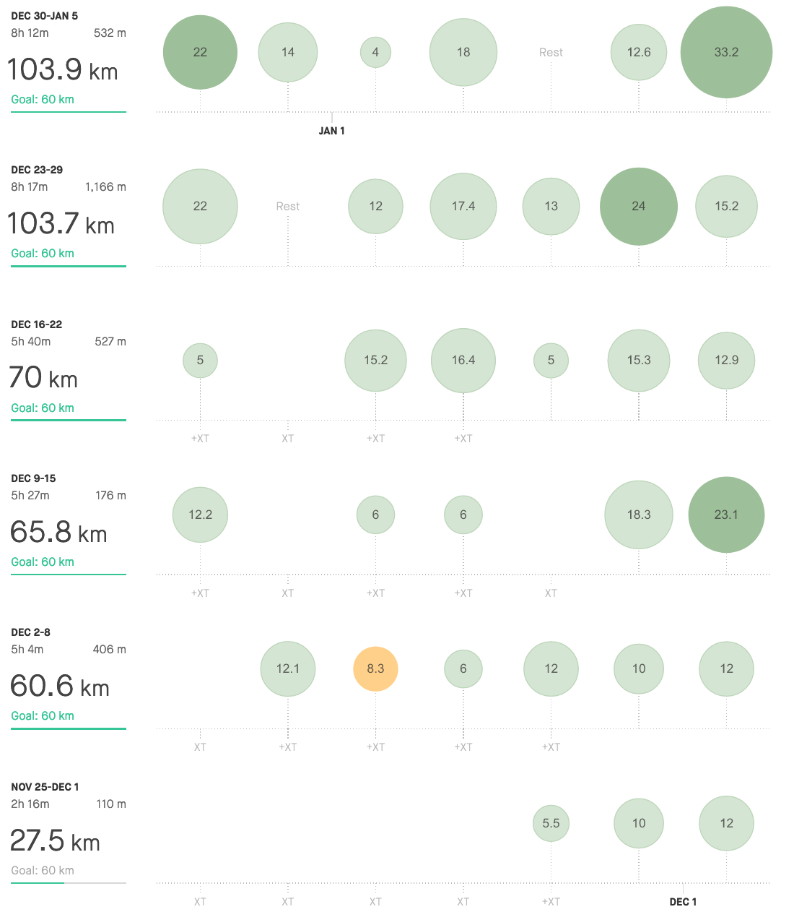

> **Here we go again! 🔫** 

 
Hard to say why is the turn of the year so hectic, when there is plenty of time to start with the winter volume session. Maybe one needs to catch a breath after the mileage began to rise again.

Anyway, I'm glad, that with this post I'm finally breaking up the "I have a delay with updating the blog" strike. Only the call it a year summary to go, and I'm back on track again. Hopefully, it would be sooner than the review of January.

I think there is not much to be writing about. After last year, when it's all started, I have already a glimpse of what the December should look like. So no surprises. Lot's of long runs to slowly start building the base.

I was a bit worried that after 140km in November, the idea of doing two times more wouldn't be anything to be looking forward to. As it turns out, I was wrong with thinking that. After specifics training, it's lovely to forget about checking the watch every once a while. There is now no need to know how fast or how long I'm already running.

As you could see below, I've done 349 km in December 2019, which is 33 km more. Not so impressive, though. The essential progress is here at the time spent out there.

Since I have my favourite routes, it is easy to check, what has changed over the last year. I'm talking here now about the speed, as you probably understand. I'm not going to give you the EXACT numbers, because I don't recall them with the best accuracy. What I do know is that last year, when I have a good day running at an easy effort, I was glad if the pace was around 4:55-5:00 min/km. Now, I'm without any extra effort comfortably sub 4:50, and when there is a good day, I'm able to run at this effort at 4:30. And the same also goes for doing recovery runs, where I've got from 6 min/km to 5:15 min/km.

For the ***Call it a Year*** post I'm planning to dig deeper into my running log and prepare something juice. Wish me luck. Lol.

| **3:00 - 3:29** | **3:30 - 3:44** | **3:45 - 3:59** | **4:00 - 4:14** | **4:15 - 4:29** | **4:30 - 4:44** | **4:44 - 4:59** | **5:00 >** | **6:00 >** | **sum** |
| --------------- | --------------- | --------------- | --------------- | --------------- | --------------- | --------------- | ---------- | ---------- | ------- |
| 0               | 0               | 0               | 2               | 19              | 100             | 143             | 85         | 0          | 349     |

