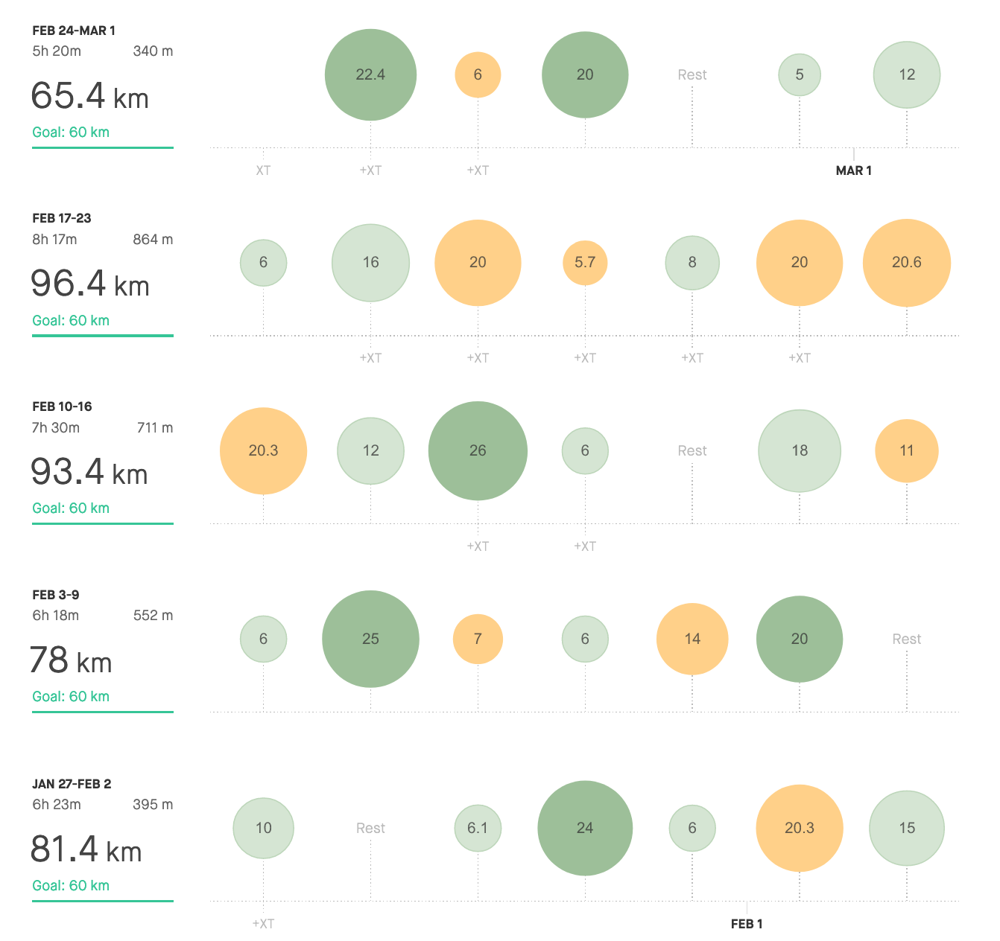

Similarly like I didn't have a clue what happened during January that I didn't break new monthly running distance, the same goes for February. But only with the difference, that in February I've actually broken new monthly distance record. For February speaking, of course.

366km is more than 360km at 2019.

Was it because of the leap year? Maybe. But leaving this fact behind, the real cause lies in 25 running days, which is 5 more than in 2019.

Admittedly, I'm glad I've managed to beat myself, but honestly, I wasn't focusing on this detail that much. The only thing which matters for me since I'm running according to my trainer's plan is to be sure I'm able to follow my plan from week to week. The bigger picture is not my concern as long as I'm ready to enjoy being out there. And occasionally run some race.

I know, it's pretty to see how the mileage is filling in the bank or to edit new PBS. But what is really at this time of a year making me happy is that I'm still running without lacking motivation and time. This year I've jumped into PhD studies, and naturally, I've started to be worried about which extent will new duties interfere with running.

Now, at the start of the new term, I could easily say that ***it doesn't interfere at all***. Moreover, it's welcomed ***refreshment*** during the day helping me to

    - *recharge my battery*
    - *shake off my duties*
    - *sort out thoughts concerning my "PhD issues"* (but hey, only sometimes when the ideas are keen enough to pop up during the running, otherwise I'm just muted or thinking about dinner)
    - *divide the working part of the day from leisure*

Running is thus one of the ***stabile element*** I'm managing my other tasks according to.

Yes, sometimes I do have to improvise a bit. Reschedule running for late evening or early morning (which is not happening that often, luckily). But in the end, knowing all the advantages why running makes sense, I'm not expecting to give on it because ***it's just doesn't fit.***

> Cliche alert!!!!!!

It's fantastic to have new PBs, but nothing actually feels any better than knowing running is what holds my day-to-day life together.

| **3:00 - 3:29** | **3:30 - 3:44** | **3:45 - 3:59** | **4:00 - 4:14** | **4:15 - 4:29** | **4:30 - 4:44** | **4:44 - 4:59** | **5:00 >** | **6:00 >** | **sum** |
| --------------- | --------------- | --------------- | --------------- | --------------- | --------------- | --------------- | ---------- | ---------- | ------- |
| 4,5             | 2               | 0               | 22              | 61              | 126             | 49              | 101        | 0          | 366     |

