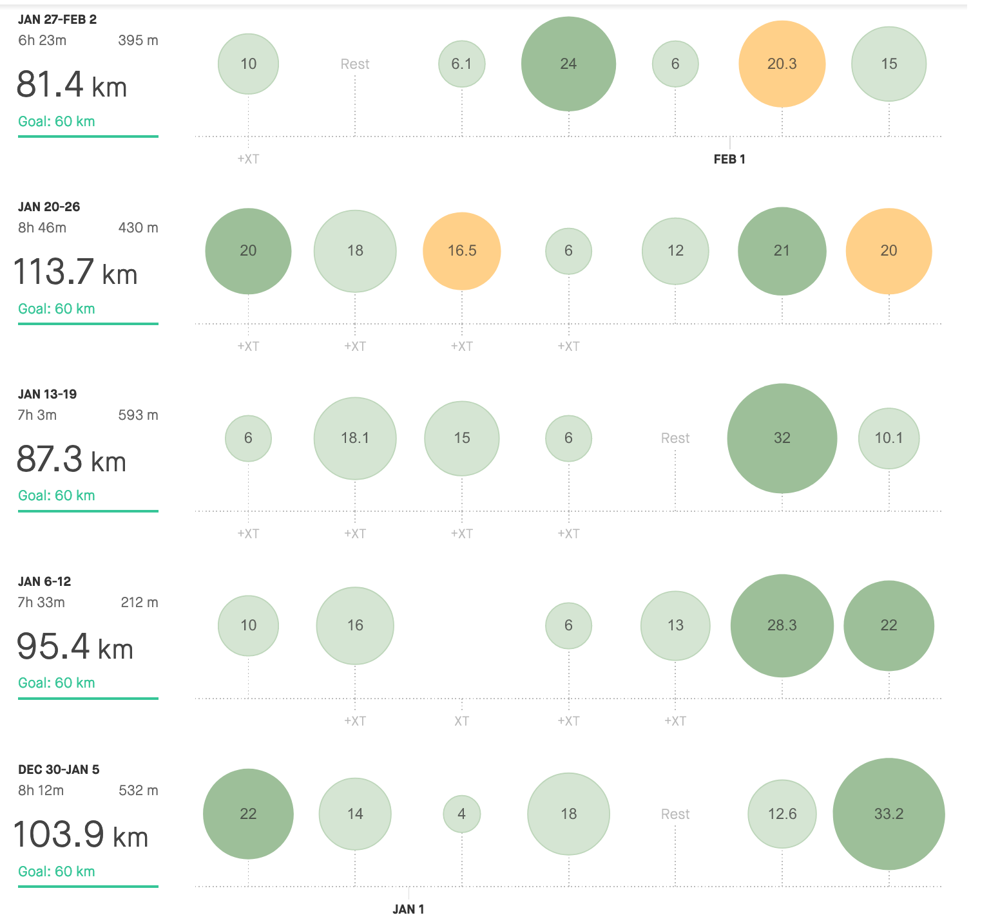

> **Volume at its best!** 

 
*"Hello, darkness, my old friend!*" 

Yes. That is the bottom line for the January, which is to put it shortly, just about being out there, putting milage in the bank ….

" *within the sound of silence."*

Surprisingly, ***410km*** is not my lifetime best. Even though it's an impressive volume, last January I ended up with 490km.

Why?

At the first time, I thought I was running fewer days this year, but according to my log 2019 and 2020 are even. 27 days for both of the years. Hard to say, what happened. My day-to-day life remains the same, so I guess that I wasn't paying that much attention to the volume. Obviously, I should have tried to do at least 100km each week.

What is definitely better this year, is my average tempo and also the endurance. I've already get used to run around 24km in 2 hours at a comfortable pace without being drained. Physically and mentally. General endurance has significantly improved. The body is recovering well, so let's see what will happen when I start putting some tempo workouts and intervals. Mainly longer tempo is planned for February.

And when I'm already talking about my plans, it's a good time to share for what I'm preparing this year.

Similarly like last year, I would like to improve in half marathon during the spring season and full marathon in the autumn. I don't have now any exact numbers, but I'm sure I want to decently beat my current PBS. Besides those two main events, I would like to try 6 hours loop-course race to challenge both the distance and also the mind. I'm not still sure if I will sign in at the end, but the seed is already in my head. And that's maybe half of the "success". I guess…

Let's keep it up with me here!

PS: I know, I still owe you the **Call it a year!**

| **3:00 - 3:29** | **3:30 - 3:44** | **3:45 - 3:59** | **4:00 - 4:14** | **4:15 - 4:29** | **4:30 - 4:44** | **4:44 - 4:59** | **5:00 >** | **6:00 >** | **sum** |
| --------------- | --------------- | --------------- | --------------- | --------------- | --------------- | --------------- | ---------- | ---------- | ------- |
| 0               | 0               | 0               | 9               | 46              | 153             | 116             | 87         | 0          | 410     |

