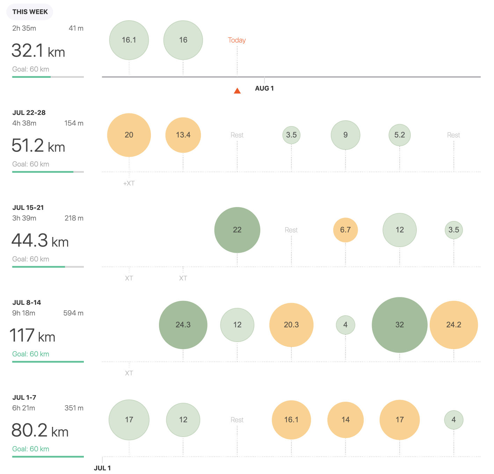

> Ok! Last two months of a training till **main peak of the season is coming up!** 

Peace Marathon in [Košice](https://www.kosicemarathon.com/?lang=en), Slovakai (6.10.2019) 🏁 is the event where I'm going to run **sub 3 hours** marathon. Yes. It is my current goal and dream time.

I've been writing about this ambition here from time to time, while it’s the main reason why I've decided to be more systematic in the training. And also why I've decided to take a step back. Step back and instead of doing 2 marathons in a year, as I did last two years, put my focus on aiming sub 90 min half-marathon. I need to gain some speed, which I've been lacking in my last marathon in [Ljubljana](https://www.strava.com/activities/1932331592/overview) (3:09).

> Am I really in sub 3 hours shape?

Honestly, this question is a good companion while running and yet, the right answer hasn't appear. The marathon distance is not new for me, but I still remember how last 10km could really kick you down.

On the other side, when looking over the past 8 months, I could see some important progress. I've did PB at 5, 10 and [21 km](https://www.tracetheheat.com/may/), almost doubled my mileage comparing to 2019, but first and foremost, I've gain a confidence in running at ***4:00 - 4:15 min/km,*** which is about the pace I should keep. Anyway we will know more in two months so stay with me. And ***keep it humble*** 🙏.

July, looking closely to my log, was a definitely intense month. Although I feel the opposite 👍. With **324** **km** finished, is this month at the third place speaking about milage ([January](https://www.tracetheheat.com/january/january/) 491km, [March](https://www.tracetheheat.com/march/march/) 350km) and definitely the first one regarding the speed 🥇. I've did, as you could see in the table below, 75 km in pace 3:45-4:14 (yes, the sub 3 hour marathon). Impressive realizing I don't feel overtrained, nor tired. I actually feel relaxed.

I hope it’s a good sign.

Best!

| **3:00 - 3:29** | **3:30 - 3:44** | **3:45 - 3:59** | **4:00 - 4:14** | **4:15 - 4:29** | **4:30 - 4:44** | **4:44 - 4:59** | **5:00 >** | **6:00 >** | **sum** |
| --------------- | --------------- | --------------- | --------------- | --------------- | --------------- | --------------- | ---------- | ---------- | ------- |
|                 |                 | 40              | 35              | 23              | 34              | 86,5            | 92,7       | 9          | 324,42  |

