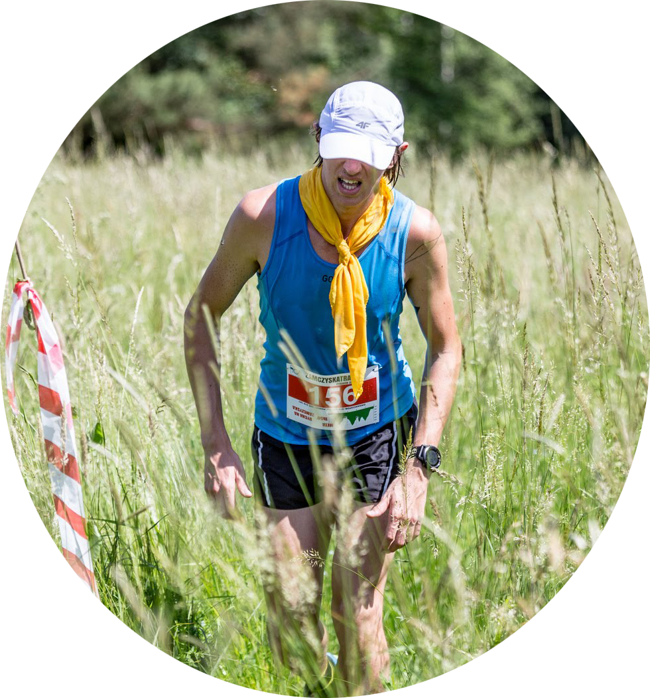
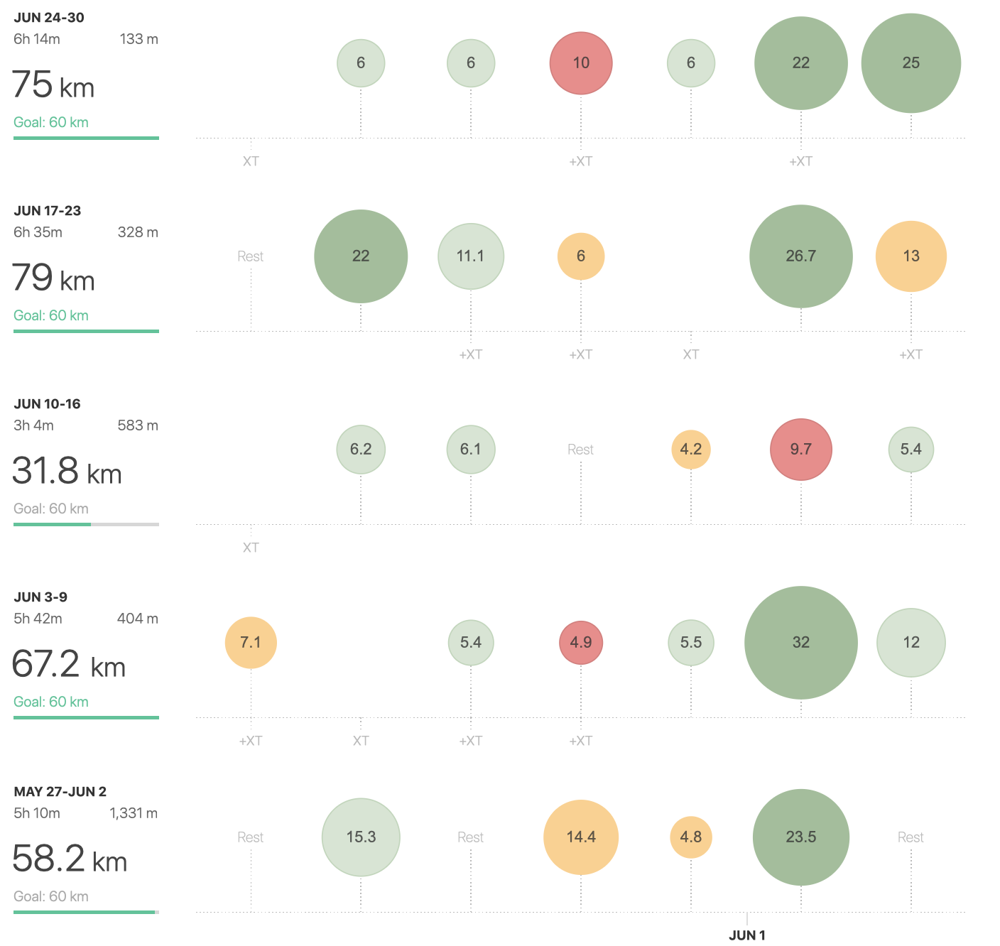

This is first time I had such a **delay with writing** this post. It’s not because I didn’t know what to share but my mind was just busy with different things and I find it difficult to squeeze my occasional running writing in to my daily routine. But that’s how life sometimes looks like. Not everything is played by the script. ***Huge Lol***

Anyway last month was very variable at all different levels. Weather was crazy, I did my first trail, PB at 10km, was resting a lot + finished the month with decent volume so the total mileage stopped at **250 km**, which is my norm.

>Oh boy how crazy sounds those 450km I did in January. Was that even me?

I have to admit I find out that in this tropical weather I felt like there is no progress in my training. One could even hear the running blues getting closer. But those are just thoughts while I’ve managed to run my first trail in the fastest group and also reach at local 10km open run my personal best. So that’s not how the running blues should looks like, I guess. 

The trail was a new experience for me. 10km doesn’t sounds like a distance to be worried about, but the elevation and almost 30C was what keep me humble. My strategy was to keep up the pace with the fastest runners from the end of the first group and try to keep it “easy” first half and speed up afterwards. As in halfmarathon, even now the strategy worked out. It felt really great to just start running faster and left other runners behind. 

Anyway this wasn’t the case how I broke up my sub 40 minutes 10km. Even though my last 3km were fast I still had a problem between 5-7 to keep the tempo I’ve set before. Naturally I hope this PB won’t last too long.

With upcoming summer I do not have any concrete running plans, but you could stay with me. You never know what could happen.

Another delay with post? New PB?...only questions. 

 3:00 - 3:29 | 3:30 - 3:44 | 3:45 - 3:59 | 4:00 - 4:14 | 4:15 - 4:29 | 4:30 - 4:44 | 4:45 - 4:59 | 5:00> | 6:00> | sum   |
|-------------|-------------|-------------|-------------|-------------|-------------|-------------|-------|-------|-------|
|2            | 8          | 11          | 4,77          | 0           | 6          | 82,2       | 135,5 | 2 | 251,5 |

