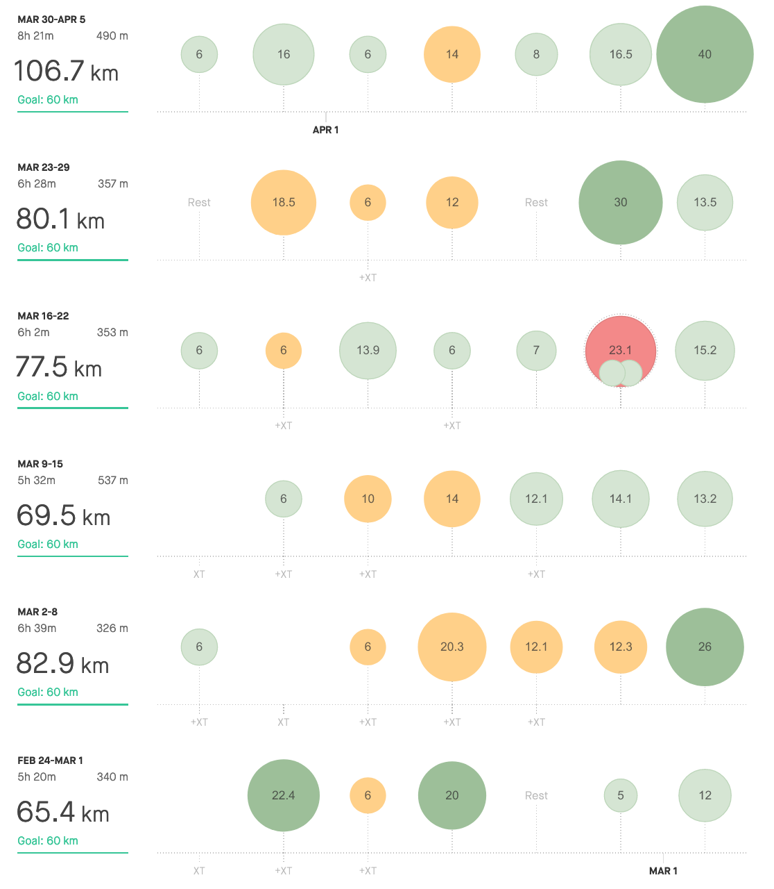

COVID-19 consequences have already caught me, and I'm glad I'm still running.

Firstly, it was cancelled half-marathon. The first race of the season.

Luckily, what connects all the runners is we are all in it's own way stubborn. Sometimes it's for a bad, but usually for good.

At least that's what I believe in. 

By following the, *"there is no bad weather, just bad pair of shoes"* we tend to find solutions to do what we love. And this is for good. It builds up the self-confidence to overcome also the struggles outside of running. At least speaking for me. Saying to myself, geez, I've done a marathon, this is not something that's going to stop me, is part of my strategy to overcome some day-to-day struggles.

So right after the first races were postponed or cancelled, the virtual ones have popped up. 

There simply was no other choice than to take part in virtual half-m. It was also planned on Sunday, but the gun time was up to me. 

And how was it?

Sure. It is hard to motivate myself without others, notably faster than me, runners. So once I've started, the plan was to be somewhere inside of 4:00-4:05 min/km pace. And it was all right. I've hit the 15th km few seconds under an hour so everything according to the plan. Unfortunately, I did not find any extra motivation to push it down more during the upcoming 5km. I've just known that I need to be inside 4:00 min/km and I have my new PB. 

Yes. I'm glad I'm progressing, but during the race, it would be probably better. I think. But what more important is, we could still be running outside. Maybe now it's not the best time for catching our personal-bests, but definitely, more than ever it is for the best to refresh our mind with some fresh air and to shake of for a while the quarantine blues.

| **2:45 - 2:59** | **3:00 - 3:29** | **3:30 - 3:44** | **3:45 - 3:59** | **4:00 - 4:14** | **4:15 - 4:29** | **4:30 - 4:44** | **4:44 - 4:59** | **5:00 >** | **6:00 >** | **sum** |
| --------------- | --------------- | --------------- | --------------- | --------------- | --------------- | --------------- | --------------- | ---------- | ---------- | ------- |
| 2,4             | 11,5            | 7               | 20,12           | 14              | 38              | 76,48           | 68,6            | 102,14     | 0          | 340,24  |

