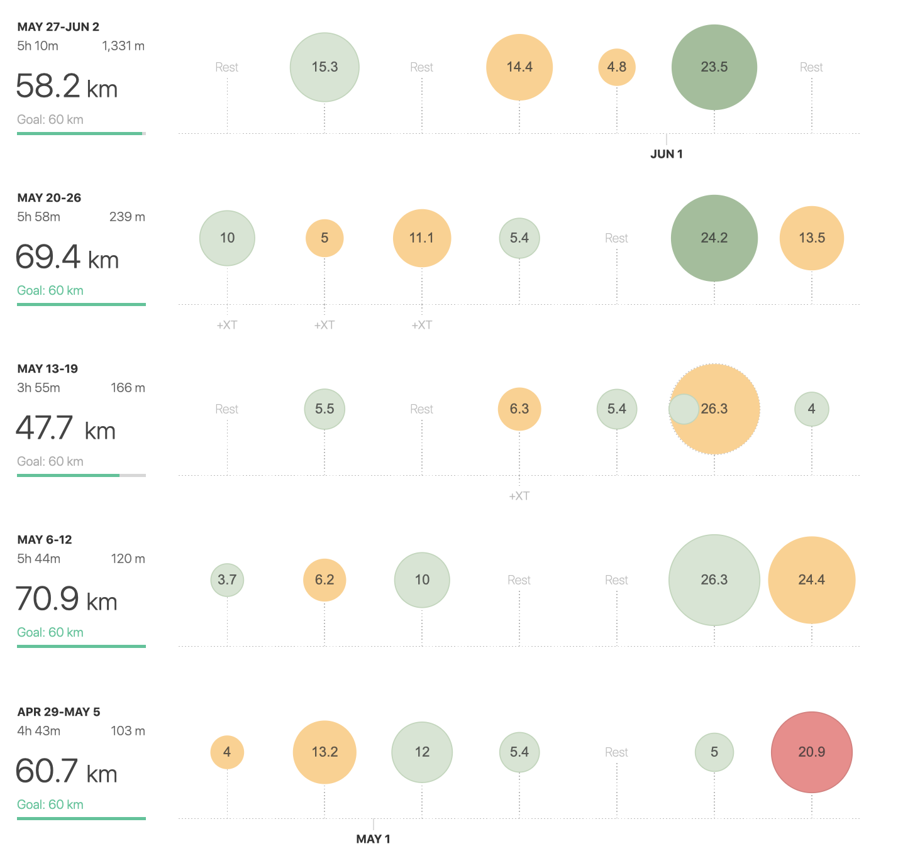

May was an important month not only because I finished my master studies, but also (and at this space more important) I’ve been tracing my new PB at half marathon distance.

>And I’ve crossed the both lines successfully!

###Half-Marathon

I’ve ended my last post with an advice for me to have a strategy for a race which was quite a new for me. I’ve never had **A, B, C** strategy targeted for the time I was trying to reach. It was usually just like do PB or get as much as close as it's possible. This race was no different. I was quite confident I’m able to do sub 90 minutes and was playing with the time around 85 minutes in my mind. The only strategy was the pacing and partly fueling (I’m not sure whether eating two gels counts as a strategy, lol). The pacing was quite simple: trying to run around 4:05 first 12 km and after trying to slowly pushing it down to 4:00 min/km till 15-18 and then ***“full gas”***.

The race itself went really well. Of course the first km was bit faster due to general excitement but shortly after reaching 1km sign I was just focusing on my tempo and ability to keep it till 12km. Besides the first and three last km I was running alone. There was a fast group in front finishing something around sub 80min (waaay to crazy) and other three runners in front of me in the more or less same tempo. Sometimes I was closer, sometimes I was not. Who or what was going on behind me I didn't know. I didn’t hear anyone coming so I was just focusing on the run. Took my first gel at 7km and was preparing for pushing the pace down. Everything was really going well. I didn’t had a hard time to be faster and shortly before 15km I took another gel + water and decided to reach small group of two in front of me. 17th kilometer and those two runners are easily behind me. None of them was trying to speed up, which was bit of a surprise for me. Anyway even though they didn’t show any extra effort to try to catch me I’ve decided to speed up a bit. It was less than 4km to the finish line. I've felt bit of a pain in my legs but nothing I should be worried about at this time. Finishing at ***85 minutes and 24 seconds*** was 6th position in open out of 226 but the **PERSONAL BEST** was the main award for me.

Although it wasn’t easy game and I was feeling tired in the end and after the race I have to admit I’m starting to really feel good in +- sub 3hour marathon pace. Hope the rest of the training will follow this trajectory so there won't be any need to be worried about on **6th of October at marathon in Košice.**

Besides the race in the beggining of the month I've been doing quite a lot short intervals to working on on my speed and few hills sessions to build the overall conditions. The tempo is starting to be faster and it comes naturally with increasing number of recovery runs or eassy effort runs. To see if its really like that I've decided to keep a more detailed log of my runs and the total sum for May is in the table below. In km, of course.

For June I'm planning to take a part in some 5km and 10km races, so lets see if I will go sub 40 min.

| 3:00 - 3:29 | 3:30 - 3:44 | 3:45 - 3:59 | 4:00 - 4:14 | 4:15 - 4:29 | 4:30 - 4:44 | 4:45 - 4:59 | 5:00> | 6:00> | sum   |
|-------------|-------------|-------------|-------------|-------------|-------------|-------------|-------|-------|-------|
|             | 6           | 24          | 31          | 9           | 11          | 78,06       | 74,36 | 28,18 | 261,6 |

