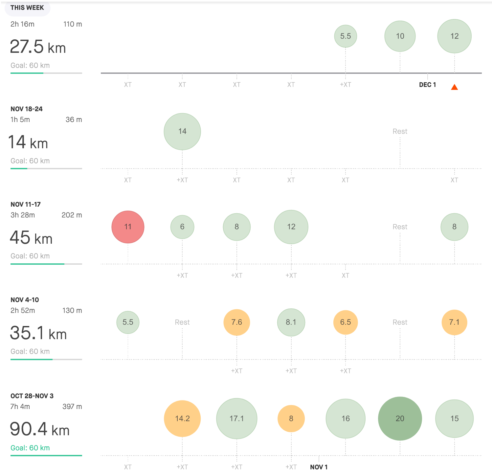

> **It’s all done! 🎂** 

 
I don’t mean I'm giving up on running but one cycle is over, which is a bit strange. Strange, because I don’t feel like it’s time, to sum up, the year at the end of November. Anyway, this is not true for the running season.

To not disappoint you, I'm going to give you in this post just a sneak peek of how the ***December 2018 - November 2019*** looked like, but for the bigger conclusion, you would have to wait till the end of December. It’s not that I don't have time nor idea now to write something (this is true just a bit), but before I started to treat my running bit seriously, I was every time starting with the beginning of the year and I want to be, when it comes to comparing 2018/2019, systematic.

Anyway, as I've just promised. With the end of this month, one season is over.

November was chilled, with only 16 running days (161km). Most of them were in an easy tempo, not checking heart rate or pace. This is also the truth for the last race I took. 11km long course in Cracow, which copied all of my favourite routes. With confidence I've gained mainly during the marathon, I was starting with the target to run sub 4:00 min/km. Tempo, which I would be quite afraid to maintain at the beginning of this year. You could check the race [here.](https://www.strava.com/activities/2857378977)

All went fine, which helped me realized, how much I've improved over the past 12 months. 12 months, when I did **3621 km** in **266 days**.  My lifetime record. **KUDOS** 

I'm wondering now, how the upcoming season will look like.

| **3:00 - 3:29** | **3:30 - 3:44** | **3:45 - 3:59** | **4:00 - 4:14** | **4:15 - 4:29** | **4:30 - 4:44** | **4:44 - 4:59** | **5:00 >** | **6:00 >** | **sum** |
| --------------- | --------------- | --------------- | --------------- | --------------- | --------------- | --------------- | ---------- | ---------- | ------- |
| 1,8             | 0               | 10,5            | 3               | 0               | 40              | 65,27           | 40,47      | 0          | 161     |

