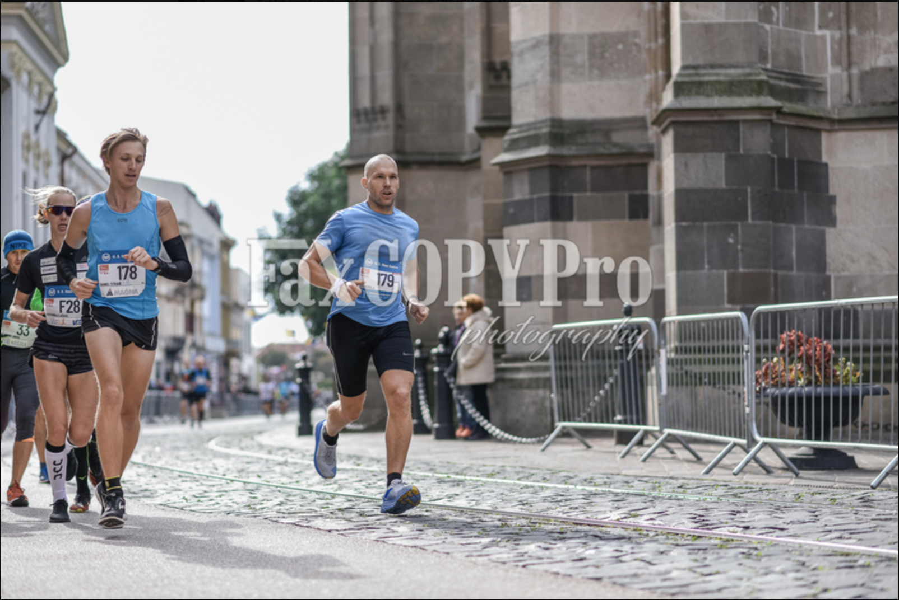
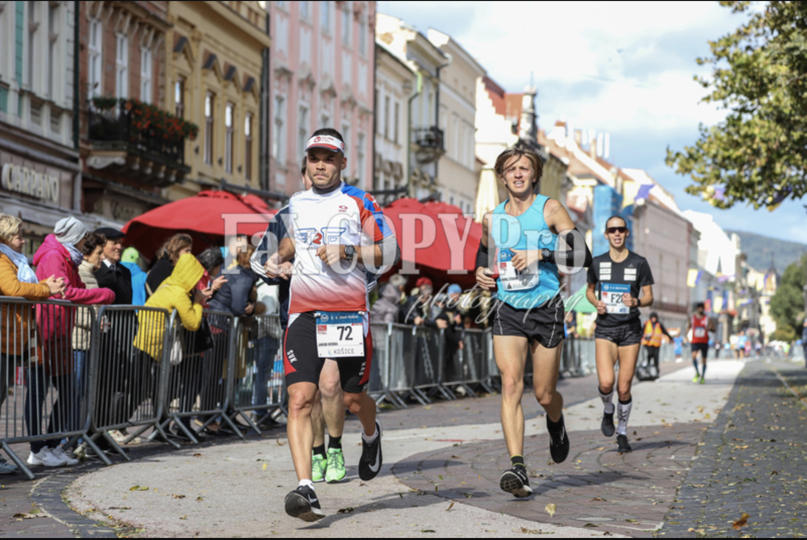
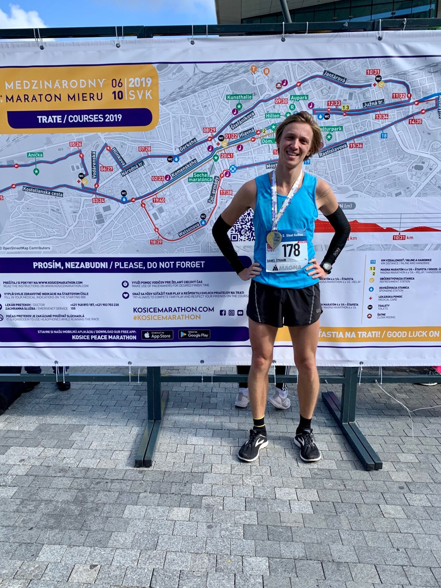
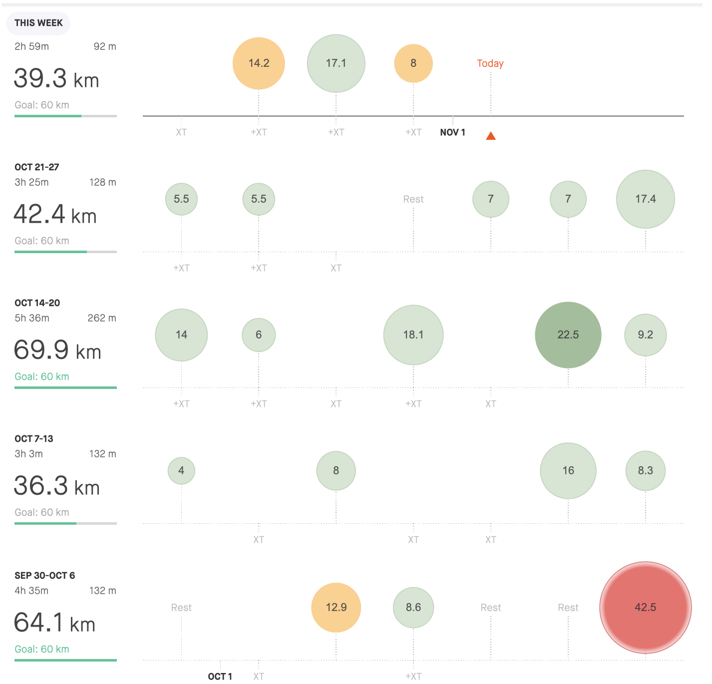

**I'm in the** ***SUB 3 HOUR CLUB*** 🏃 
 

> well actually 2:56:44 > you could check the race [here](https://www.strava.com/activities/2766878840)

 
 and now the recap of the race, which was the best I've done so far!

Sub three hours marathon was the only goal for 2019. The only target I was focusing on and imagining when I was going through the whole and long training session. Of course, I was not preparing the whole year only for one race. The other milestones were going for my PB at 5, 10 and 21 km, but their purpose was mainly to test my fitness and to check whether my endurance is at sub 3 hour level. 

The event where I choose to test my limits (geez, how weirdly this sounds, while I'm writing this part of the post on 12th of October. Yes, the day when Elide Kipchoge finished the marathon in 1:59:40) was Peace Marathon in Kosice (Slovakia 🇸🇰 ). The oldest marathon in Europe ().

After analyzing my last marathon in Ljubljana (2018, 3h10m), I planned to run first half around 1:28-29 and keep the same tempo for the second round, which is the same, as a year ago. Target was to run somehow at 4:05 - 4:10 min/km and I have to admit, I've had quite a mixed feelings about it. Anyway, no one said, that running in this pace is going to be easy peezy lemon squeeze. 

Long story short. After the gunshot, I stuck to my tempo and was flowing the crowd. 

The first half was amazing and I wasn't paying much attention I'm running a marathon. It was just an ordinary run and each split inside 4:05-4:10 was just signalling everything is fine. No need to worry. 

I've passed a half-m marker at 1:27:47. At this point, I've started to be more focused on what's going on and is ahead. Lady next to me, with who (and other 4guys) I was running from 7th km just saying that now it's up to us to take the train home sub 3. I've just cheered her with the fact, it's also my premiere. She smiled and we all, knowing we are comfortable inside our goal time, started to be more focused on the run. 

After the first half, I was quite worried I'm running too fast and I will pay the price later. Anyway as you could see in the split down there, the wall just wasn't coming. We were all keeping the same tempo and oh man how fantastic it was seeing on my watch I'm passing 24, 28, 35 km at 4:05-4:10. 

Unfortunately, from 35th till 39 km I slowed down to sub 4:25 due to strong wind. No matter how much I was trying, I've just could maintain to be within 4:15. I was tired, but not without motivation to give up or play an easy game, because I was safely in my goal time. I was still trying to go back to 4:10 and the last 3km, when the track was turning in to the city, was slowly getting there. Anyway, it was too late to be sub 2:56. 

I've once read that good marathon is the one, where you could see the tiny little window for improvement and I think it perfectly fits here. I'm happy I've managed to finish safely sub 3hours and I'm unsurprisingly looking forward to another challenge. 

**5km splits**

1 - 5 km 20:31
5 - 10 km 20:19
10 - 15 km 20:37
15 - 20 km 20:39
*half-marathon 1:27:47*
20 - 25 km 20:31
25 - 30 km 20:32
30 - 35 km 20:41
35 - 40 km 22:01 -→ 🌬️ 
*marathon 2:56:44*

| **3:00 - 3:29** | **3:30 - 3:44** | **3:45 - 3:59** | **4:00 - 4:14** | **4:15 - 4:29** | **4:30 - 4:44** | **4:44 - 4:59** | **5:00 >** | **6:00 >** | **sum** |
| --------------- | --------------- | --------------- | --------------- | --------------- | --------------- | --------------- | ---------- | ---------- | ------- |
| 0               | 3,3             | 9               | 40              | 16,3            | 63,63           | 78,02           | 40,76      | 0          | 251,01  |

Anyway as you could see, I didn't stop running after reaching my goal. With a few recovery weeks, I'm now already back in shape, enjoying autumn perfect weather for running and thinking about to what I should run into the upcoming season.

