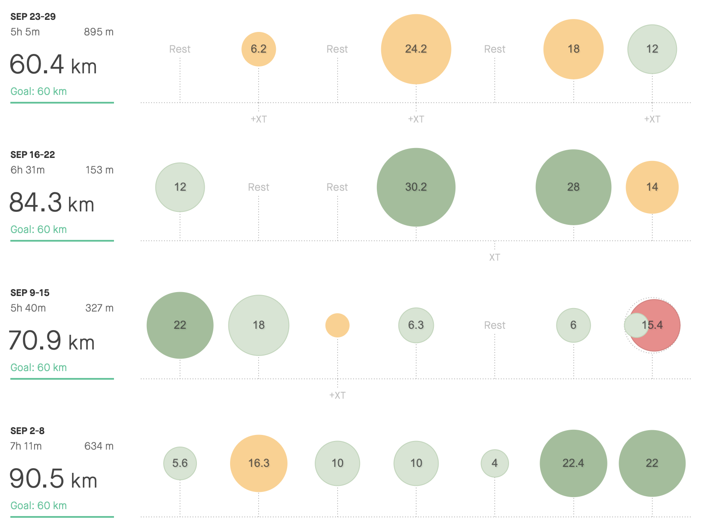

> The big DAY is comming! 🏃‍♂️ 

Even though I did not beat any PB this month, September was a good one! With a small drop in temperature I've enjoyed running my long runs at faster pace while being able to stay in the same fitness zone. This fact help me with my mind setting.

The start of the race is just behind the doors, so the whole September was quite relaxed. Long runs and hills sessions with just few fast trainings around my marathon pace. I think, the body is well rested and I'm well prepared to do my personal best. Let's just see if it will be enough to get under 3 hours.

My strategy is to be consistent with sub3 hour pace. This was the same strategy for my last marathon year ago, but I've bonked at 25km and finished the race at 3:10. With better training this whole year - increased total mileage + quality (I've never been that fast), I believe, I will be able to keep the sub 3 tempo. Of course I'm going to try to have a negative split in the second half.

That’s all for now!

| **3:00 - 3:29** | **3:30 - 3:44** | **3:45 - 3:59** | **4:00 - 4:14** | **4:15 - 4:29** | **4:30 - 4:44** | **4:44 - 4:59** | **5:00 >** | **6:00 >** | **sum** |
| --------------- | --------------- | --------------- | --------------- | --------------- | --------------- | --------------- | ---------- | ---------- | ------- |
| 1               | 0               | 5               | 29              | 38              | 97,35           | 60,4            | 74,79      | 0          | 305,54  |

