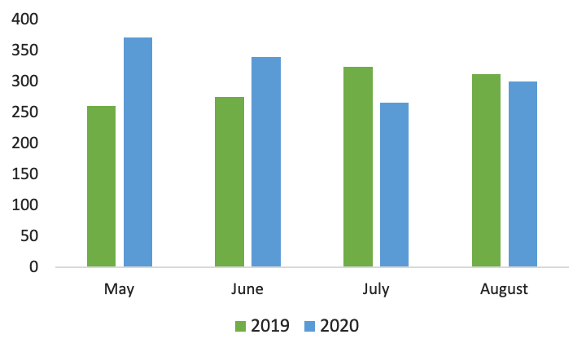

Ok!

It is time to bring this site back to its life. The fact I've been on-hold this summer is because I've failed in finding short-term goals. It does not mean I've stopped running. Not at all! I only did not know what to share here once the races are being postponed, cancelled or quickly sold out.

Even though I don't think of myself as addictive to running races, they do indeed represent an essential input into training. A vital refreshment to push it harder, reflecting the past kilometres of training. Check-out box to keep up with running.

So that is basically why, but now the twist is coming. Or this is what I hope for with a local half-marathon just around the corner and marathon later this autumn. But let's wait for that…

My total mileage for summer 2020 is **1278km**, which is more than last summer. However, in total, the difference is not as impressive as I've thought initially. I guess that is the bias effect of May where the volume was quite remarkable.

You could bet I'm glad being on track to pass 4000km this year. Even though I know the total mileage is not the most crucial thing of running, it is still making me happy to see I'm getting there.

What, however, is making me happier, is to know how the mileage differs in terms of pace. Last may I've started to log each run into this pace-table, which you could see bellow and finally the circle has closed, and I could compare the same month to each other.

Just with a short glimpse, it is possible to see that I'm getting faster. Indeed, I've already broken some PBs this year. Also, my easy or recovery runs are being bit faster given the fact I'm running at the same effort. Indeed, those changes are relatively slow, but I hope it is also suggesting the trend I'm going to follow even in the upcoming months and years.

So stay tuned and see you soon next time with the Call it a Month, rather than Call it an Autumn.

|                 | **2:45-2:59** | **3:00-3:29** | **3:30-3:44** | **3:45-3:59** | **4:00-4:14** | **4:15-4:29** | **4:30-4:44** | **4:45-4:59** | **5:00>** | **6:00>** | **SUM** |
| --------------- | ------------- | ------------- | ------------- | ------------- | ------------- | ------------- | ------------- | ------------- | --------- | --------- | ------- |
| **May 2019**    | 0             | 0             | 6             | 24            | 31            | 9             | 11            | 78            | 74        | 28        | 261     |
| **May 2020**    | 2             | 12            | 15            | 24            | 3             | 14            | 88            | 105           | 108       | 0         | 371     |
| **June 2019**   | 0             | 2             | 8             | 11            | 5             | 0             | 6             | 82            | 135       | 2         | 251     |
| **June 2020**   | 0             | 4             | 4             | 16            | 23            | 29            | 99            | 69            | 96        | 0         | 340     |
| **July 2019**   | 0             | 0             | 0             | 40            | 35            | 23            | 34            | 87            | 96        | 9         | 324     |
| **July 2020**   | 1             | 7             | 5             | 18            | 8             | 5             | 41            | 82            | 99        | 0         | 266     |
| **August 2019** | 0             | 0             | 2             | 14            | 65            | 41            | 38            | 49            | 100       | 3         | 312     |
| **August 2020** | 0             | 4             | 23            | 17            | 14            | 20            | 56            | 70            | 97        | 0         | 301     |

